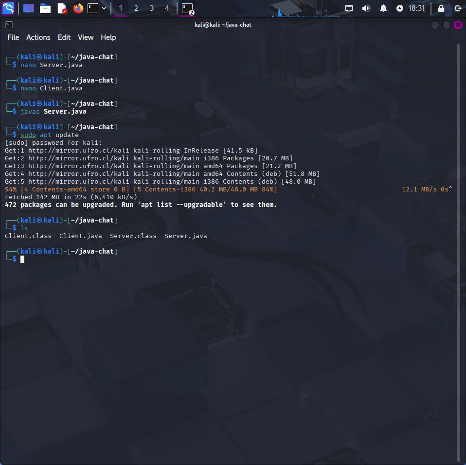
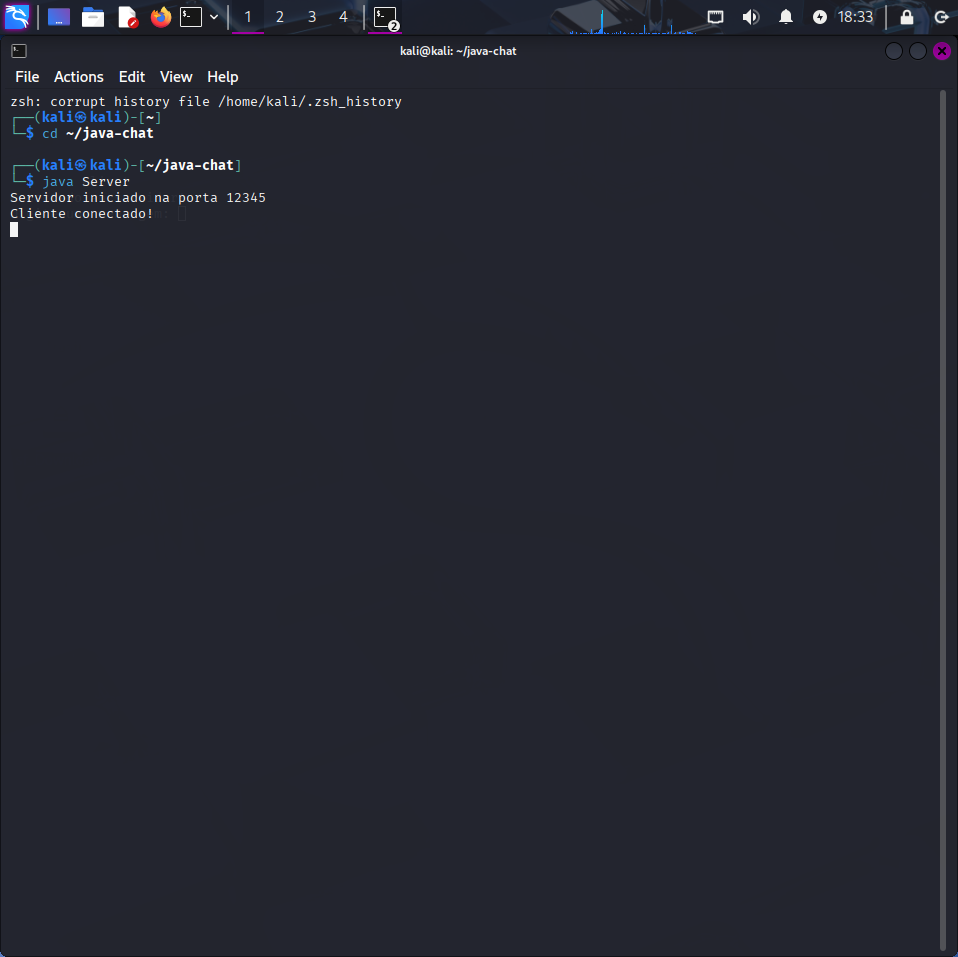
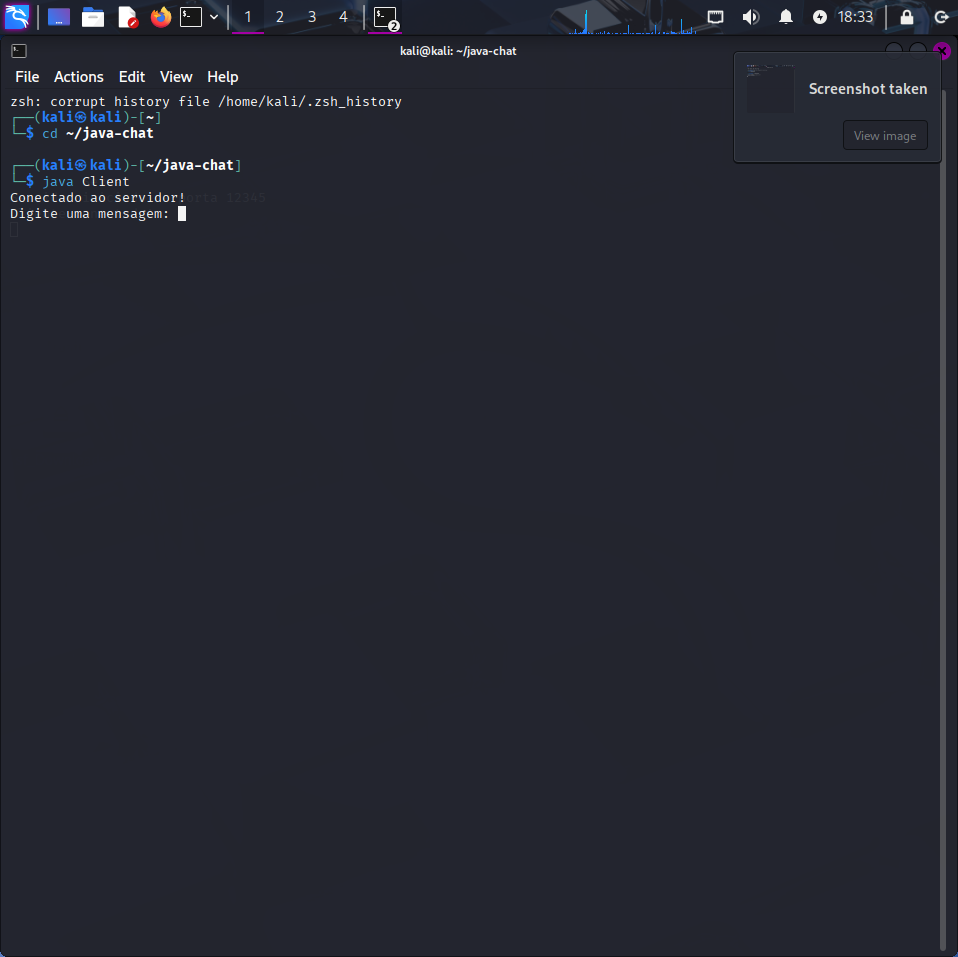
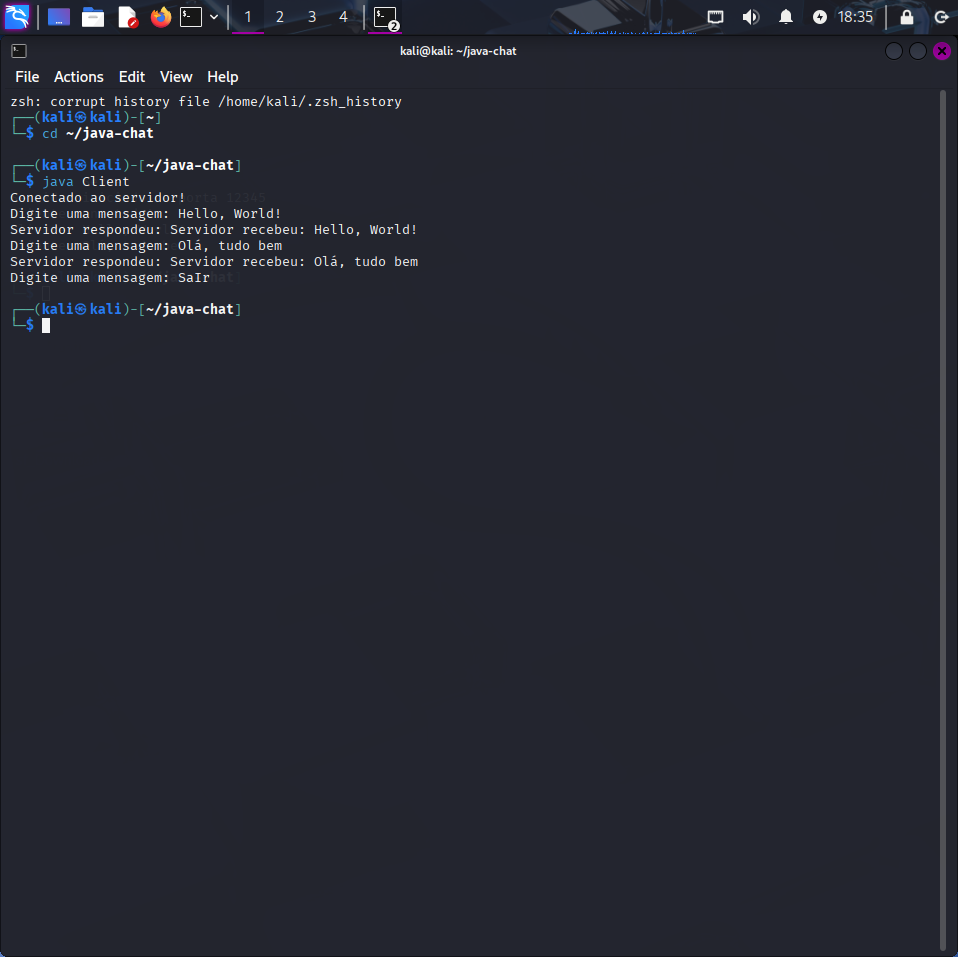
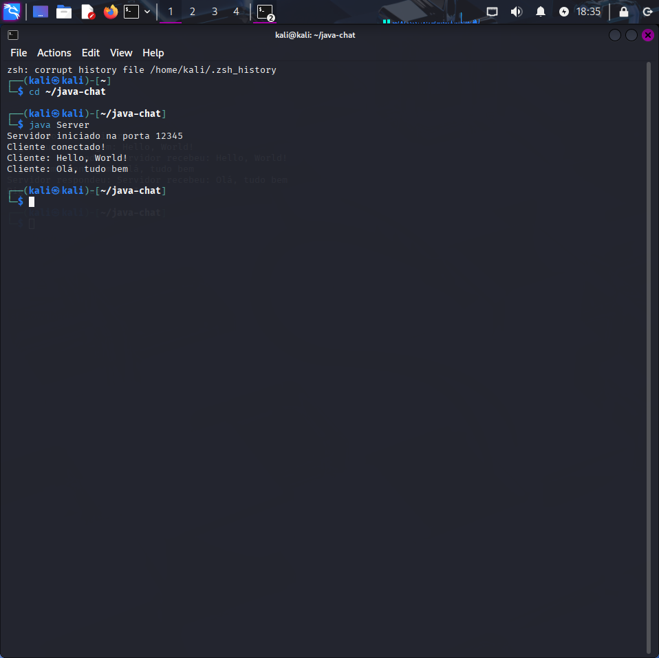

# Java Socket Chat


## Descrição
Este é um projeto simples de chat em Java utilizando **sockets**. Ele permite que um cliente se conecte a um servidor e troque mensagens em tempo real. O foco deste projeto é demonstrar conceitos básicos de **conexão de rede**, **entrada/saída de dados** e **programação orientada a objetos** em Java.


## Funcionalidades
- Comunicação entre **um cliente e um servidor**.
- Mensagens enviadas pelo cliente são recebidas e respondidas pelo servidor.
- Comando **"sair"** para encerrar o cliente (independente de maiúsculas/minúsculas).


## Como usar:

##1. Compilar arquivos:
```bash
-cd ~/java-chat
-javac Server.java Client.java

##2. Rodar o servidor:
-java Server

##3. Rodar o cliente (abra outro terminal):
-java Client

##4. Testar o chat
-Digite no terminal do cliente e veja a resposta no servidor;
-Para encerrar, digite "sair"(funciona indepente de upper/lower case);


## Exemplos de execução:

### Cliente e Servidor rodando





